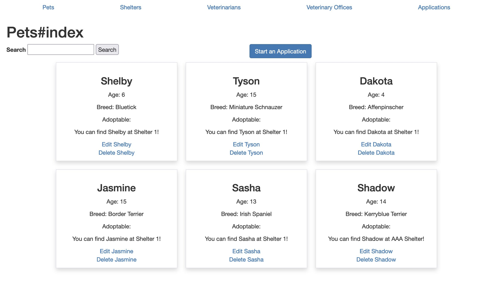
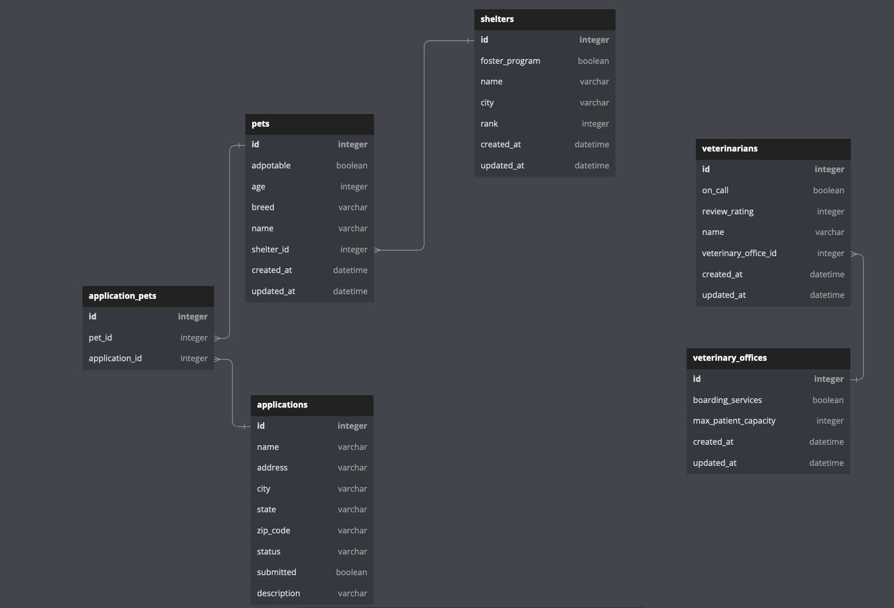

<!-- Improved compatibility of back to top link: See: https://github.com/marchandmd/adopt_dont_shop/pull/73 -->

<a name="readme-top"></a>

<!--
*** Thanks for checking out the adopt_dont_shop. If you have a suggestion
*** that would make this better, please fork the repo and create a pull request
*** or simply open an issue with the tag "enhancement".
*** Don't forget to give the project a star!
*** Thanks again! Now go create something AMAZING! :D
-->

<!-- PROJECT SHIELDS -->
<!--
*** I'm using markdown "reference style" links for readability.
*** Reference links are enclosed in brackets [ ] instead of parentheses ( ).
*** See the bottom of this document for the declaration of the reference variables
*** for contributors-url, forks-url, etc. This is an optional, concise syntax you may use.
*** https://www.markdownguide.org/basic-syntax/#reference-style-links
-->

[![Contributors][contributors-shield]][contributors-url]
[![Forks][forks-shield]][forks-url]
[![Stargazers][stars-shield]][stars-url]
[![Issues][issues-shield]][issues-url]
[![MIT License][license-shield]][license-url]
[![LinkedIn][linkedin-shield]][linkedin-url]

<!-- PROJECT LOGO -->
<br />
<div align="center">

  <h1 align="center">Adopt Don't Shop</h1>

  <p align="center">
    <h3>A Pet Adoption platform that neables users to apply to adopt a pet, and for Admins to approve or reject the applicaiotns ans see statistics for the Shelters, Pets and Applications in the system.</h3>
    <br />
  
    <br />
    <a href="https://github.com/turingschool-examples/adopt_dont_shop"><strong>Explore the docs »</strong></a>
    <br />
    <br />
    <a href="https://github.com/marchandmd/adopt_dont_shop">View Demo</a>
    ·
    <a href="https://github.com/marchandmd/adopt_dont_shop/issues">Report Bug</a>
    ·
    <a href="https://github.com/marchandmd/adopt_dont_shop/issues">Request Feature</a>
  </p>
</div>

<!-- TABLE OF CONTENTS -->
<details>
  <summary>Table of Contents</summary>
  <ol>
    <li>
      <a href="#about-the-project">About The Project</a>
      <ul>
        <li><a href="#built-with">Built With</a></li>
      </ul>
    </li>
    <li>
      <a href="#getting-started">Getting Started</a>
      <ul>
        <li><a href="#prerequisites">Prerequisites</a></li>
        <li><a href="#installation">Installation</a></li>
      </ul>
    </li>
    <li><a href="#schema">Schema</a></li>
    <li><a href="#usage">Usage</a></li>
    <li><a href="#roadmap">Roadmap</a></li>
    <li><a href="#contributing">Contributing</a></li>
    <li><a href="#license">License</a></li>
    <li><a href="#contact">Contact</a></li>
    <li><a href="#acknowledgments">Acknowledgments</a></li>
  </ol>
</details>

<!-- ABOUT THE PROJECT -->

## About The Project

See the [user stories](https://github.com/turingschool-examples/adopt_dont_shop/blob/main/doc/user_stories.md) used to drive the production of this application

Concepts learned during this project:

- Build out CRUD functionality for a many to many relationship
- Use ActiveRecord to write queries that join multiple tables of data together
- Use MVC to organize code effectively, limiting the amount of logic included in views and controllers
- Validate models and handle sad paths for invalid data input
- Use flash messages to give feedback to the user
- Use partials in views
- Use within blocks in tests
- Track user stories using GitHub Projects
- Deploy your application to the internet


<p align="right">(<a href="#readme-top">back to top</a>)</p>

### Built With

-   [![Ruby][ruby.com]][ruby-url]
-   [![Rspec][rspec.com]][rspec-url]

<p align="right">(<a href="#readme-top">back to top</a>)</p>

<!-- GETTING STARTED -->

## Getting Started

### Prerequisites

- ruby version 2.7.4

### Installation

1. Clone the repo
    ```sh
    git clone https://github.com/marchandmd/adopt_dont_shop.git
    ```
2. Install packages
    ```sh
    bundle
    ```

<p align="right">(<a href="#readme-top">back to top</a>)</p>

<!-- Schema -->

## Schema




<p align="right">(<a href="#readme-top">back to top</a>)</p>

<!-- USAGE EXAMPLES -->

## Usage

- `rails db:{create,migrate}`
You can see this locally by running `rails s` from the command line.


<p align="right">(<a href="#readme-top">back to top</a>)</p>

<!-- ROADMAP -->

## Roadmap

- README
- [ ] Deploy to Heroku student account
- [ ] Add to marchandmd.github.io

See the [open issues](https://github.com/marchandmd/adopt_dont_shop/issues) for a full list of proposed features (and known issues).

<p align="right">(<a href="#readme-top">back to top</a>)</p>

<!-- CONTRIBUTING -->

## Contributing

Contributions are what make the open source community such an amazing place to learn, inspire, and create. Any contributions you make are **greatly appreciated**.

If you have a suggestion that would make this better, please fork the repo and create a pull request. You can also simply open an issue with the tag "enhancement".
Don't forget to give the project a star! Thanks again!

1. Fork the Project
2. Create your Feature Branch (`git checkout -b feature/AmazingFeature`)
3. Commit your Changes (`git commit -m 'Add some AmazingFeature'`)
4. Push to the Branch (`git push origin feature/AmazingFeature`)
5. Open a Pull Request

<p align="right">(<a href="#readme-top">back to top</a>)</p>

<!-- LICENSE -->

## License

Distributed under the MIT License. See `LICENSE.txt` for more information.

<p align="right">(<a href="#readme-top">back to top</a>)</p>

<!-- CONTACT -->

## Contact

Michael Marchand - MichaelDavidMarchand@gmail.com

Project Link: [https://github.com/MarchandMD/adopt_dont_shop](https://github.com/marchandmd/adopt_dont_shop)

<p align="right">(<a href="#readme-top">back to top</a>)</p>

<!-- ACKNOWLEDGMENTS -->

## Acknowledgments

Some great tools and/or people who helped to make this project what it is!

-   [Choose an Open Source License](https://choosealicense.com)
-   [GitHub Emoji Cheat Sheet](https://www.webpagefx.com/tools/emoji-cheat-sheet)
-   [Img Shields](https://shields.io)
-   [GitHub Pages](https://pages.github.com)
-   [Rubocop](https://rubocop.org/)

<p align="right">(<a href="#readme-top">back to top</a>)</p>

<!-- MARKDOWN LINKS & IMAGES -->
<!-- https://www.markdownguide.org/basic-syntax/#reference-style-links -->

[contributors-shield]: https://img.shields.io/github/contributors/marchandmd/adopt_dont_shop.svg?style=for-the-badge
[contributors-url]: https://github.com/marchandmd/adopt_dont_shop/graphs/contributors
[forks-shield]: https://img.shields.io/github/forks/marchandmd/adopt_dont_shop.svg?style=for-the-badge
[forks-url]: https://github.com/marchandmd/adopt_dont_shop/network/members
[stars-shield]: https://img.shields.io/github/stars/marchandmd/adopt_dont_shop.svg?style=for-the-badge
[stars-url]: https://github.com/marchandmd/adopt_dont_shop/stargazers
[issues-shield]: https://img.shields.io/github/issues/marchandmd/adopt_dont_shop.svg?style=for-the-badge
[issues-url]: https://github.com/marchandmd/adopt_dont_shop/issues
[license-shield]: https://img.shields.io/github/license/marchandmd/adopt_dont_shop.svg?style=for-the-badge
[license-url]: https://github.com/marchandmd/adopt_dont_shop/blob/master/LICENSE.txt
[linkedin-shield]: https://img.shields.io/badge/-LinkedIn-black.svg?style=for-the-badge&logo=linkedin&colorB=555
[linkedin-url]: https://linkedin.com/in/mmarchand1/
[product-screenshot]: images/screenshot.png
[bootstrap.com]: https://img.shields.io/badge/Bootstrap-563D7C?style=for-the-badge&logo=bootstrap&logoColor=white
[bootstrap-url]: https://getbootstrap.com
[ruby.com]: https://img.shields.io/badge/ruby-v2.7.4-red
[ruby-url]: https://ruby-doc.org/core-2.7.4/
[rspec.com]: https://img.shields.io/badge/rspec-v3.11-success
[rspec-url]: https://rspec.info/documentation/
